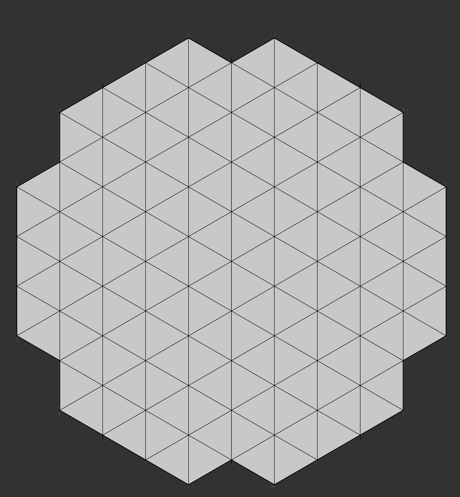

<div align="center">


**A digital adaptation of the YINSH abstract strategy board game**

Built with Python and Pygame — play locally, against an AI, or over the network.


[Features](#features) | [Getting Started](#getting-started) | [How to Play](#how-to-play) | [Network Play](#network-play) | [Project Structure](#project-structure)

</div>

---

## Overview

YINSH is a two-player combinatorial strategy game from the [GIPF Project](https://en.wikipedia.org/wiki/GIPF_project) series. Players place rings on a hexagonal board, move them to leave markers, flip opponent markers along the path, and try to form rows of five same-colored markers to score points.

This project is a full digital implementation featuring local multiplayer, an AI opponent, and peer-to-peer network play.

<div align="center">

</div>

## Features

- **Local Multiplayer** — Two players on the same machine, taking turns
- **AI Opponent** — Play against the computer in single-player mode
- **Network Multiplayer** — Peer-to-peer play over TCP/IP (host/client architecture)
- **Two Game Modes** — *Normal* (3 alignments to win) and *Blitz* (1 alignment to win)
- **Full Rule Enforcement** — Ring placement, marker flipping, alignment detection, and scoring
- **Move Preview** — Visual indicators showing valid moves before committing
- **Fullscreen UI** — Clean interface with custom fonts and board rendering
- **Pre-built Executables** — Ready-to-run binaries for Windows, macOS, and Linux

## Getting Started

### Prerequisites

- [Python 3.12+](https://www.python.org/downloads/)
- [Pygame 2.5.2](https://www.pygame.org/)

### Installation

```bash
git clone https://github.com/Karasu-huginn/1PROJ.git
cd 1PROJ
pip install pygame==2.5.2
```

### Run the game

```bash
python main.py
```

### Pre-built executables

If you prefer not to install Python, pre-built executables are available in the repository:

| Platform | Host (Server) | Client |
|----------|--------------|--------|
| Windows  | `windows/host - main/yinsh.exe` | `windows/client/yinshclient.exe` |
| macOS    | `Macos/` | `Macos/` |
| Linux    | `linux/` | `linux/` |

> [!NOTE]
> Network play is currently only supported on Windows. macOS and Linux builds run in local mode only.

## How to Play

### Game rules

1. **Setup** — Each player places 5 rings on the board
2. **Move** — Select one of your rings and move it along a straight line (horizontal, vertical, or diagonal)
3. **Mark** — Moving a ring leaves a marker of your color in the starting position
4. **Flip** — Any markers along the ring's path are flipped to the opposite color
5. **Score** — When you form a row of 5 markers in your color, remove them and one of your rings
6. **Win** — First player to remove 3 rings wins (Normal) or 1 ring (Blitz)

### Game modes

From the main menu, choose between:

- **Jouer sur ce PC** — Local play (2 players or vs AI), then select Normal or Blitz
- **Jouer en ligne** — Network play (host a game or join as client)

## Network Play

YINSH uses a peer-to-peer architecture over TCP on port `1111`.

**Host a game:**
1. Launch `main.py` and select *Jouer en ligne*
2. Your local IP is displayed — share it with the other player
3. Wait for the client to connect

**Join a game:**
1. Launch the client (`client_side/testcli.py` or the client executable)
2. Enter the host's IP address
3. The game starts once connected

> [!TIP]
> Both players must be on the same local network, or the host must have port `1111` forwarded for internet play.

## Project Structure

```
1PROJ/
├── main.py                 # Main entry point and game loops
├── plateau.py              # Board logic, movement, and alignment detection
├── menu.py                 # Main menu UI
├── normal_blitz.py         # Game mode selection screen
├── jouer_sur_ce_pc.py      # Local play menu
├── entrer_ip.py            # IP input dialog
├── interface_win.py        # Victory screen
├── testserv.py             # Network server class
├── testcli.py              # Network client class
├── client_side/            # Client-side code for network play
├── host_side/              # Host-side code for network play
├── documentation/          # Project documentation (in French)
├── fonts/                  # RobotoSlab custom font
├── windows/                # Pre-built Windows executables
├── Macos/                  # Pre-built macOS executables
├── linux/                  # Pre-built Linux executables
├── yinsh.png               # Game logo
├── yinsh_board.png         # Board image
└── yinsh-plateau.jpeg      # Board background texture
```

## Tech Stack

| Component | Technology |
|-----------|-----------|
| Language | Python 3.12 |
| Graphics | Pygame 2.5.2 |
| Networking | Python `socket` + `threading` |
| Build | PyInstaller |

## Credits

YINSH is a board game designed by Kris Burm, part of the [GIPF Project](https://www.gipf.com/) series.

This digital adaptation was built as a final project for [Supinfo](https://www.supinfo.com/).
